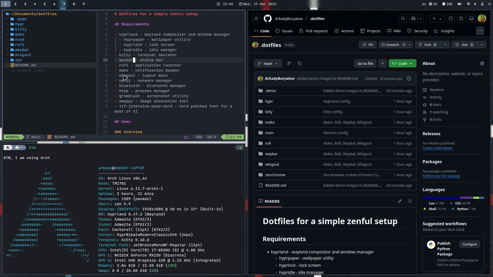
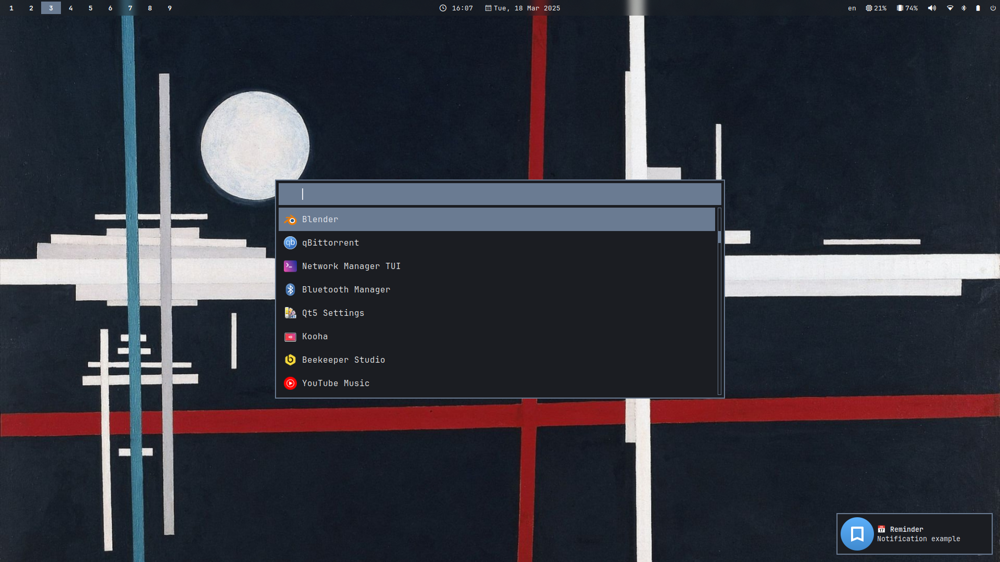
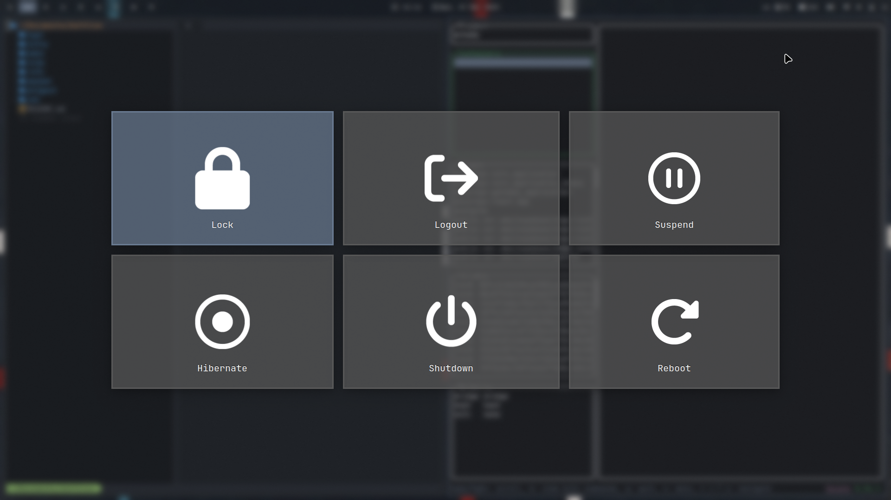
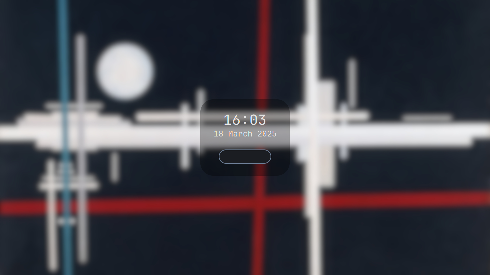

# Dotfiles for a simple zenful setup

# TODO
- finish howdy instruction
- setup greetd with tui-greet

## Requirements

- hyprland - wayland compositor and window manager
  - hyprpaper - wallpaper utility
  - hyprlock - lock screen
  - hypridle - idle manager
- kitty - terminal emulator
- waybar - status bar
- rofi - application launcher
- mako - notification daemon
- wlogout - logout menu
- nmtui - network manager
- bluetuith - bluetooth manager
- btop - process manager
- grimblast - screenshot utility
- swappy - image annotation tool
- ttf-jetbrains-mono-nerd - nerd patched font for a most of UI
- keyd - daemon for custom keyboard behaviour

## Demo

### Overview

### App launcher and notification

### WLogout menu

### Lock screen

